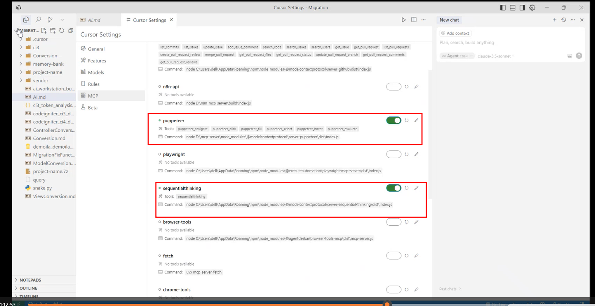
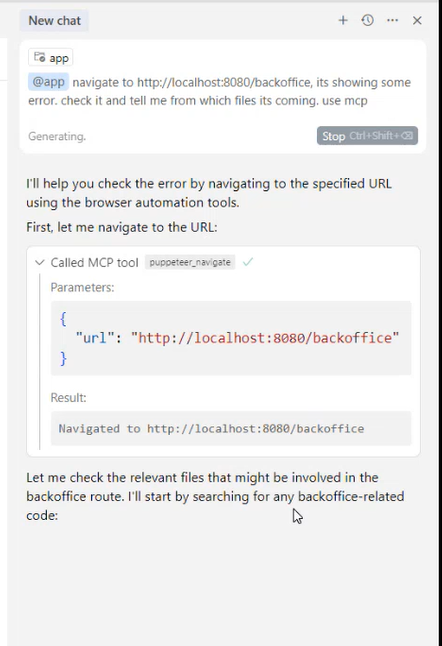
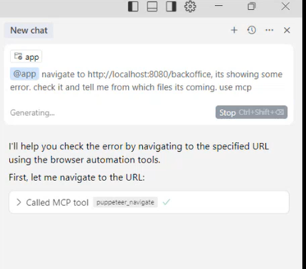
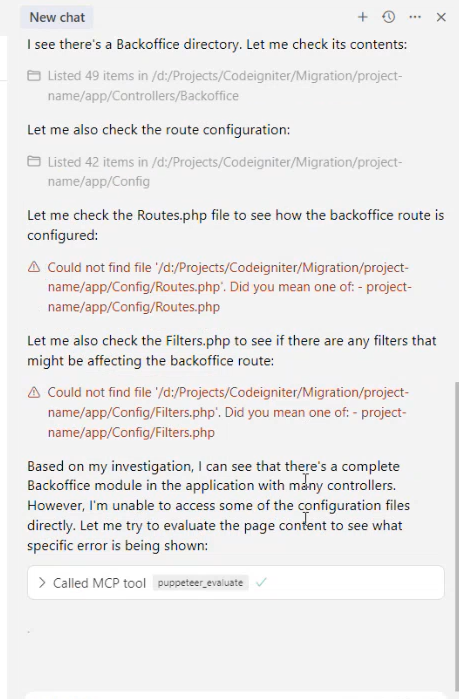
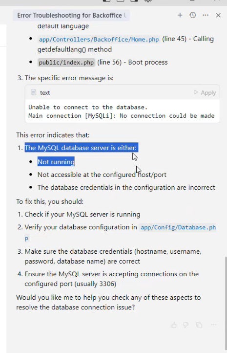
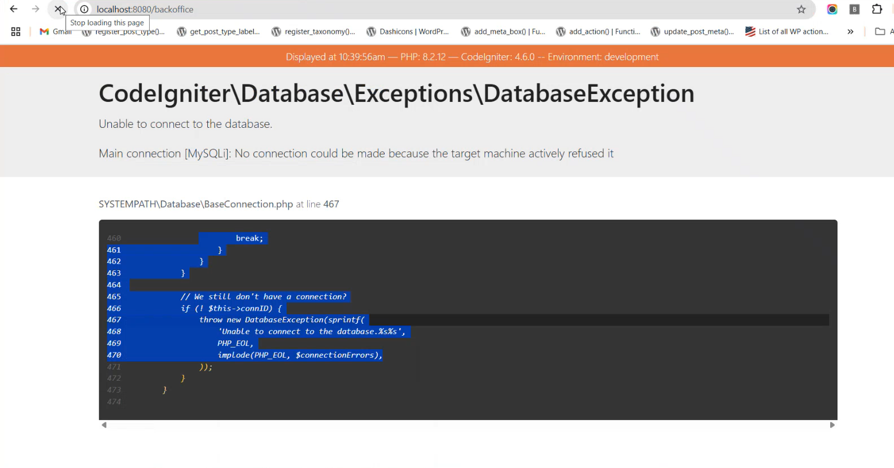
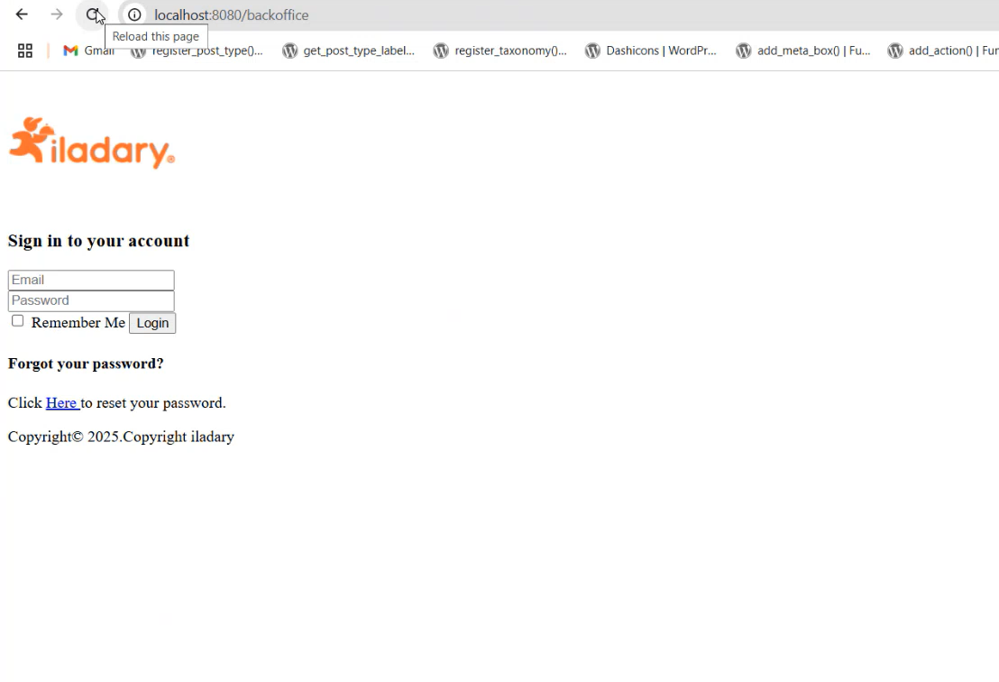

# Building an AI Code Editor with MCP: Step-by-Step Guide

This guide explains, step by step, how to create an AI code editor that leverages the Model Context Protocol (MCP) to extend AI agent abilities. It uses real screenshots to illustrate each stage and follows MCP thinking for adaptive, context-aware, and future-proof design.

---

## 1. Introduction: Why Combine AI Code Editors with MCP?

- **AI code editors** are tools that help developers write, debug, and understand code using AI agents.
- **MCP (Model Context Protocol)** is an open standard that lets AI agents connect to external tools, data, and services through a single, unified protocol.
- By integrating MCP, your AI code editor can dynamically discover and use new tools, automate workflows, and collaborate with other agents—making it much more powerful and flexible.

---

## 2. MCP Thinking: The Foundation

- **Protocol-First:** Design your editor to use MCP for all integrations, not custom APIs.
- **Dynamic Discovery:** Allow the editor to find and use new tools at runtime.
- **Context Exchange:** Enable rich, structured context sharing between the editor and external tools.
- **Interoperability:** Make your editor a hub for collaboration between multiple AI agents and services.

---

## 3. Step-by-Step: Building the AI Code Editor with MCP

### Step 1: Setting Up MCP Tools in the Editor

- Go to your editor's settings and enable MCP tools such as `puppeteer` (for browser automation) and `sequentialthinking` (for advanced reasoning).
- **Screenshot Reference:**
  

### Step 2: Using MCP Tools in Real Scenarios

- Example: Ask the AI agent to navigate to a web page, check for errors, and trace the source files using MCP tools.
- The agent uses `puppeteer` to automate browser actions and `sequentialthinking` to reason through the problem.
- **Screenshot Reference:**
  
  

### Step 3: Automated Investigation and Reasoning

- The agent can:
  - Search for relevant files and directories.
  - Check route configurations and filters.
  - Evaluate page content and extract error messages.
- **Screenshot Reference:**
  
  

### Step 4: Diagnosing and Explaining Issues

- The AI agent analyzes the error (e.g., database connection failure), explains possible causes, and suggests solutions.
- **Screenshot Reference:**
  

### Step 5: End-to-End Automation and Feedback

- The agent can reload pages, check fixes, and provide step-by-step feedback to the user.
- **Screenshot Reference:**
  

---

## 4. Best Practices for MCP-Enabled Code Editors

- **Security:** Always secure MCP endpoints with authentication and authorization.
- **Context Management:** Share only relevant context to protect privacy and improve results.
- **Documentation:** Keep integration docs up to date for both tool providers and agent developers.
- **Monitoring:** Track usage and update capabilities as MCP evolves.

---

## 5. Conclusion: The Power of MCP Thinking

By following MCP thinking and integrating MCP into your AI code editor, you:

- Unlock dynamic, context-aware, and future-proof capabilities.
- Enable seamless collaboration between agents, tools, and data sources.
- Make your editor a true AI-powered productivity hub.

---

**Further Reading:**

- [Model Context Protocol Official Site](https://modelcontextprotocol.io/introduction)
- [Anthropic: Introducing the Model Context Protocol](https://www.anthropic.com/news/model-context-protocol)
- [MCP vs API: Model Context Protocol explained](https://norahsakal.com/blog/mcp-vs-api-model-context-protocol-explained/)
