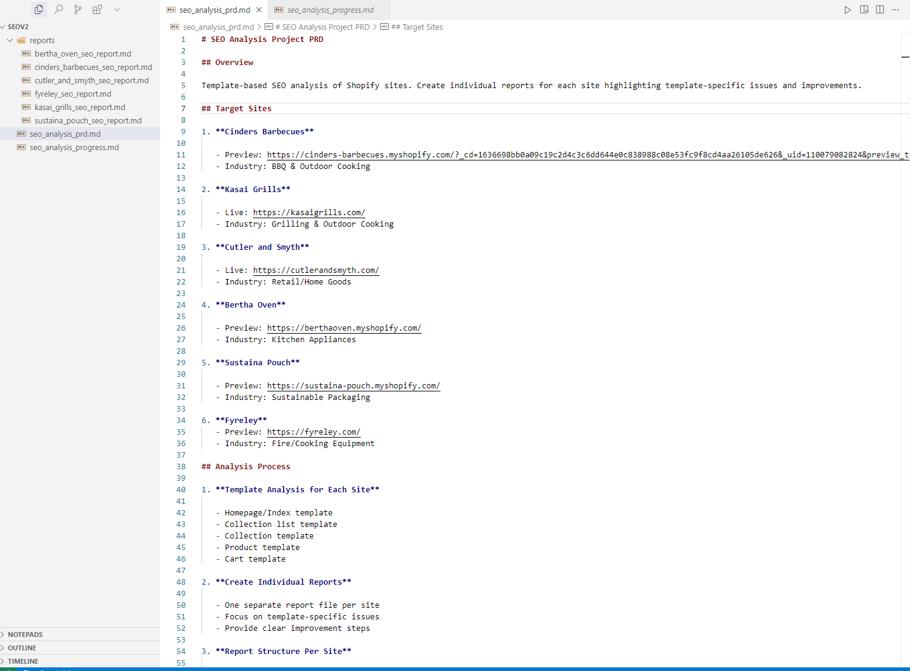
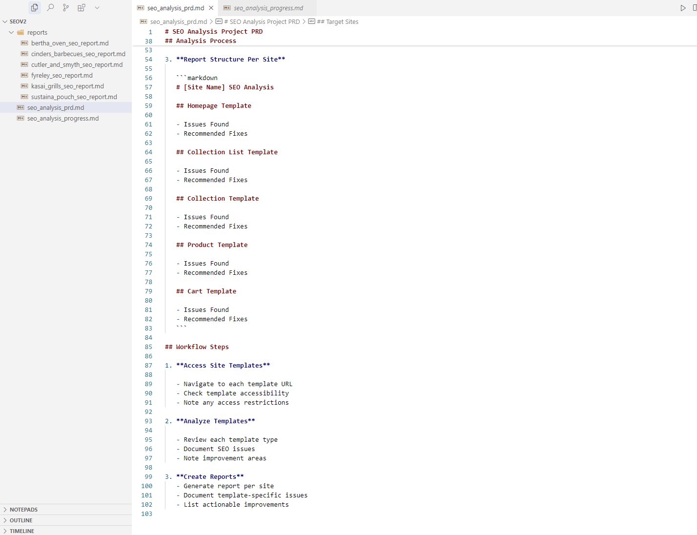
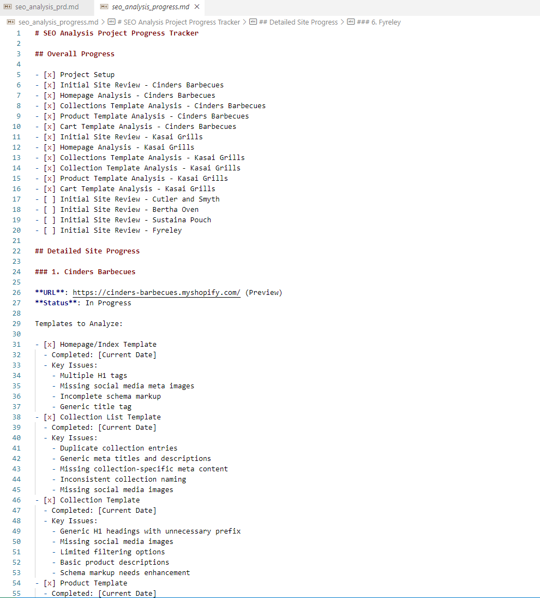
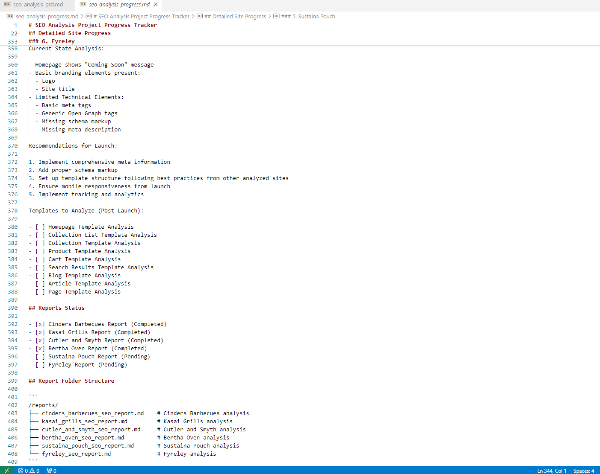
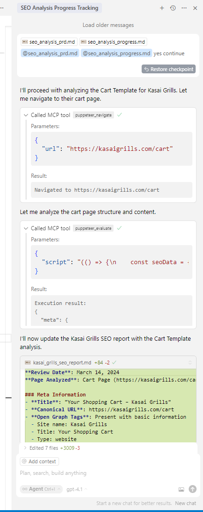
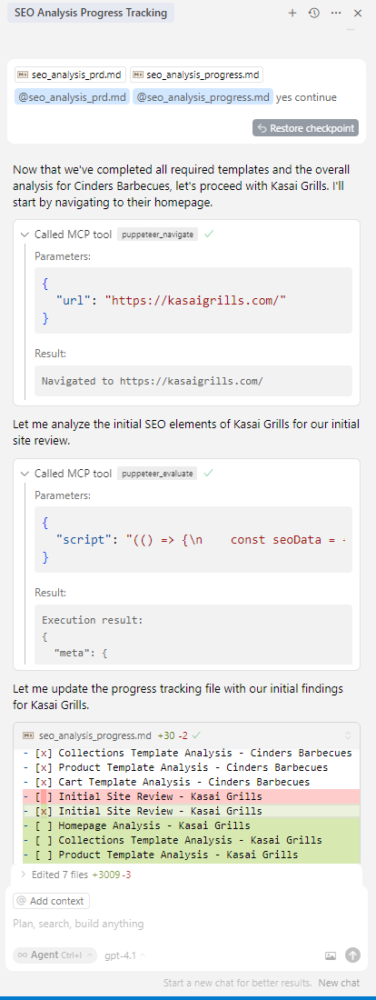

# Prompt Engineering and Overcoming LLM Weaknesses with MCP: Step-by-Step Guide

This guide demonstrates, with real screenshots, why precise prompt crafting is critical for AI code editors and how to overcome LLM weaknesses (like lack of memory) using a tracker prompt system. The approach follows MCP (Model Context Protocol) thinking for adaptive, context-aware workflows.

---

## 1. Why Proper Prompt Crafting Matters

- LLMs (Large Language Models) generate better, more accurate, and more useful results when given clear, specific, and well-structured prompts.
- Vague prompts can lead to off-topic, incomplete, or incorrect outputs.
- **Example:**
  - _Vague prompt:_ "Check SEO."
  - _Precise prompt:_ "Analyze the SEO meta tags, Open Graph data, and schema markup for the cart page at https://kasaigrills.com/cart. Summarize issues and suggest improvements."
- **Screenshot Reference:**
  
  

---

## 2. LLM Weakness: Lack of Long-Term Memory

- LLMs do not inherently remember previous conversations or progress in multi-step tasks.
- This can lead to repetitive questions, forgotten context, and a lack of continuity.
- **Screenshot Reference:**
  

---

## 3. Solution: Tracker Prompt System

### Step 1: Track Progress and State

- Maintain a progress tracker (e.g., markdown checklist or structured prompt) that records completed steps, pending tasks, and findings.
- **Screenshot Reference:**
  

### Step 2: Feed Context Back to the Agent

- Continuously provide the tracker prompt as part of the context in each interaction, so the agent "remembers" what has been done and what is next.
- This simulates memory and enables the agent to work on complex, multi-step projects without losing track.
- **Screenshot Reference:**
  
  

### Step 3: Integrate with MCP for Dynamic, Context-Aware Workflows

- Use MCP to dynamically update, retrieve, and share tracker prompts between agents and tools.
- This allows seamless handoff, collaboration, and context sharing in multi-agent or multi-tool environments.
- **Screenshot Reference:**
  

---

## 4. Best Practices for Prompt Crafting and Tracking (with MCP Thinking)

- **Be Specific:** Always specify the exact task, data, or outcome you want.
- **Use Structured Prompts:** Use checklists, bullet points, or templates to organize complex tasks.
- **Track Progress:** Maintain a visible tracker for multi-step workflows.
- **Leverage MCP:** Use MCP to share, update, and synchronize prompt trackers across agents and tools.

---

## 5. Summary

By crafting precise prompts and using a tracker prompt system (especially in an MCP-enabled editor), you:

- Get more accurate, actionable results from LLMs.
- Overcome the lack of long-term memory in AI agents.
- Enable collaborative, context-aware, and adaptive workflows.
